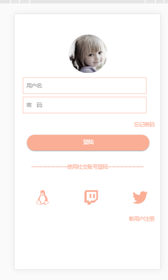
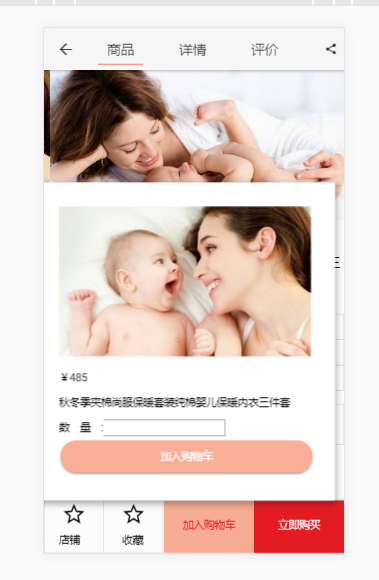
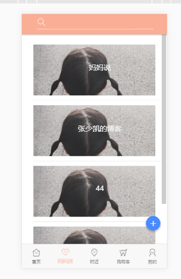
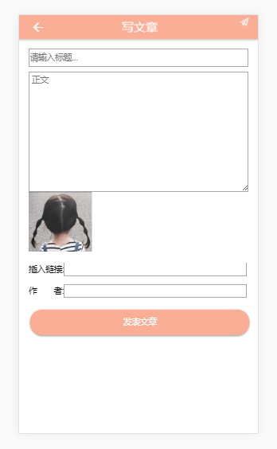
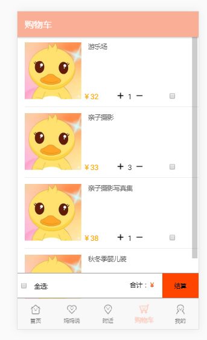
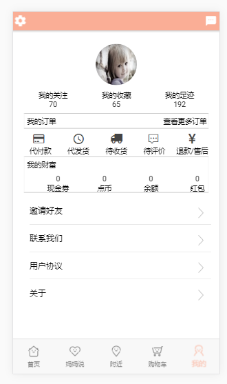

# 《点点》项目简介
《点点》是一款主打母婴产品的APP。

### 项目成员：
* 吴鹏杰 (项目经理，客户端代码开发，产品) 
    * Email: <abcdefj4201385@qq.com>
    * Github : [https://github.com/PennJay](https://github.com/PennJay) 
* 张少凯 (服务器代码开发，产品，UI设计) 
    * Email: <1054764349@qq.com>
    * Github : [https://github.com/shokai7878](https://github.com/shaokai7878)
* 刘雨帆 (客户端代码开发，测试，UI设计)
    * Email: <1159075148@qq.com>
    * Github : [https://github.com/YuFanL](https://github.com/YuFanL)
* 高鸿 (客户端代码开发，测试，UI设计)
    * Email: <979956869@qq.com>
    * Github : [https://github.com/qiytan](https://github.com/qiytan)
* 曹倩 (客户端代码开发，测试，UI设计)
    * Email: <caoqiann@qq.com>
    * Github : [https://github.com/caoqiann](https://github.com/caoqiann)
* 齐紫荆 (服务器代码开发，测试，UI设计)
    * Email: <3304496257@qq.com>
    * Github : [github.com/qizijing](github.com/qizijing)

### 分工声明：

点点APP共分为五个版块，分别为“首页”、“妈妈说”、“附近”、“购物车”、“我的”。

分工：刘雨帆-->“妈妈说”、齐紫荆-->“首页”、吴鹏杰-->“附近”、高鸿-->“我的”、曹倩-->“购物车”、后台-->张少凯。

前端页面框架，我们选用的是ionic。底部代码统一，主题色调统一。

后台采用node.js的express框架编写，数据库使用mysql进行交互。

### 效果图：

