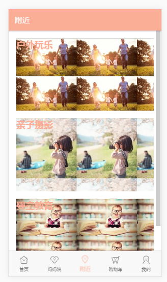

# 《点点》APP
这是点点APP的项目实训

分工声明：

点点APP共分为五个版块，分别为“首页”、“妈妈说”、“附近”、“购物车”、“我的”。

分工：刘雨帆-->“妈妈说”、齐紫荆-->“首页”、吴鹏杰-->“附近”、高鸿-->“我的”、曹倩-->“购物车”。

前端页面框架，我们选用的是ionic。底部代码统一，主题色调统一。

后台采用node.js的express框架编写，数据库使用mysql进行交互。

